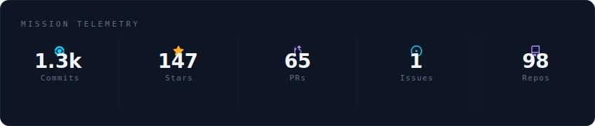

  

### 🌟 João Victor | Fullstack Developer

🚀 **Mission:** Building robust apps & stunning interfaces.
💻 **Stack:** Node.js, React.js, Next.js, TypeScript.
🗄️ **Data:** MongoDB, PostgreSQL, MySQL.
🎓 **Academic:** Information Systems @ UNITINS.
💼 **Experience:** Founder & Dev @ JoaoIto.

---

  

 

  

 

 ## Social:
    

 

  

<picture>
  <source
    media="(prefers-color-scheme: dark)"
    srcset="https://raw.githubusercontent.com/platane/snk/output/github-contribution-grid-snake-dark.svg"
  />
  <source
    media="(prefers-color-scheme: light)"
    srcset="https://raw.githubusercontent.com/platane/snk/output/github-contribution-grid-snake.svg"
  />
  
</picture>

